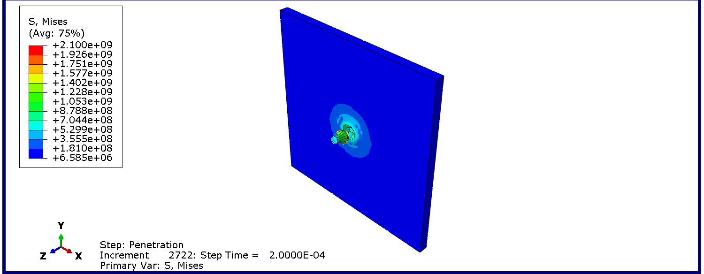
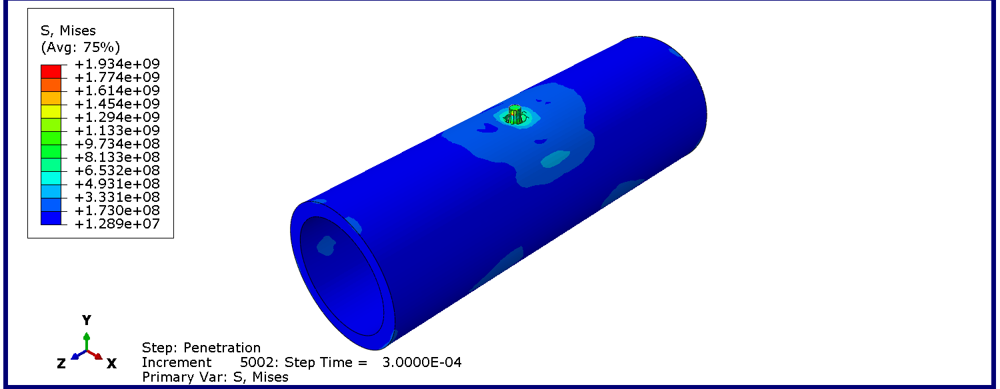

# Abaqus MCP Autostart for opencode

**A low-cost Abaqus AI automation assistant that lets AI agents drive simulation workflows through MCP.**

This project adapts [Cai-aa/abaqus-mcp](https://github.com/Cai-aa/abaqus-mcp) for opencode and other local MCP clients. It is not just a collection of Abaqus scripts: it turns Abaqus/CAE into an agent-callable simulation environment where an AI assistant can generate Abaqus Python, build models, submit jobs, inspect ODB files, capture result images, and support post-processing workflows from natural-language instructions.

> Chinese summary: this project makes Abaqus callable by AI agents. Users describe simulation tasks in natural language, and the agent can use MCP tools to drive modeling, solving, result reading, screenshots, and post-processing.

## What Is This Project?

The original Abaqus MCP architecture has two processes:

- `mcp_server.py` runs outside Abaqus and exposes MCP tools to an AI client.
- `abaqus_mcp_plugin.py` runs inside Abaqus/CAE and polls file-based commands.

Many MCP clients, including opencode, can start the first process but do not automatically start the Abaqus-side polling loop. That causes a common failure mode: the MCP server appears in the client, but `check_abaqus_connection` reports `stopped` or times out.

This adaptation adds an autostart wrapper:

- `mcp_server_autostart.py` checks whether the Abaqus backend is running.
- If needed, it launches `abaqus cae noGUI=start_abaqus_mcp_nogui.py`.
- It waits until the Abaqus backend reports `running`.
- It then delegates to the original `mcp_server.py`.

The result is a smoother workflow for AI-assisted Abaqus automation, especially when using opencode with low-cost models such as DeepSeek.

## Key Features

- Natural-language-driven Abaqus automation through an MCP client.
- Automatic Abaqus noGUI backend startup for opencode.
- Execute Python scripts inside the Abaqus kernel environment.
- Query Abaqus model structure, jobs, materials, steps, loads, boundary conditions, and interactions.
- Submit Abaqus jobs already defined in the current session.
- Read ODB metadata such as steps, frames, parts, and instances.
- Capture Abaqus viewport images as base64 data URLs.
- File-based IPC design inherited from the upstream project.
- Windows helper scripts for manual backend start/stop.

## What You Can Do With This Project

- Describe an Abaqus simulation task in natural language.
- Let an AI agent generate and execute Abaqus Python scripts.
- Build or modify CAE models through agent-written scripts.
- Submit and monitor Abaqus jobs exposed in the current session.
- Extract ODB metadata for result inspection.
- Export viewport images for reports or review.
- Ask the AI to write CSV exporters, plots, or post-processing scripts using Abaqus Python.
- Run simple parameter studies at low LLM cost by repeatedly generating or modifying scripts.

## Quick Start

### 1. Requirements

- Windows
- Abaqus/CAE installed and licensed
- Python with the `mcp` package installed
- opencode, or another MCP client that can launch a local stdio server

Install the Python MCP package if needed:

```powershell
pip install mcp
```

### 2. Configure opencode

Copy or merge this into your opencode config:

```json
{
  "$schema": "https://opencode.ai/config.json",
  "mcp": {
    "abaqus-mcp-server": {
      "type": "local",
      "command": [
        "python",
        "C:\\path\\to\\abaqus-mcp\\mcp_server_autostart.py"
      ]
    }
  }
}
```

On Windows, the usual global opencode config location is:

```text
%USERPROFILE%\.config\opencode\opencode.json
```

This repository also includes:

- `opencode.config.example.json` for a generic opencode example
- `opencode.local.example.json` for the local machine layout used during development
- `.mcp.example.json` for clients that use the common `mcpServers` format

### 3. Start opencode

Start opencode normally. When opencode launches `abaqus-mcp-server`, `mcp_server_autostart.py` will:

1. read `status.json`, if it exists
2. decide whether the Abaqus backend is already running
3. start `abaqus cae noGUI=start_abaqus_mcp_nogui.py` if needed
4. wait for the backend status to become `running`
5. run the original `mcp_server.py`

### 4. Test the connection

Ask your MCP client to call:

```text
check_abaqus_connection
```

Expected result:

```text
Connected to Abaqus MCP v4.0.0.
Status: running
```

You can also call:

```text
ping
```

Expected result:

```text
pong (v4.0.0)
```

## Examples / Case Studies

Case studies show what this project can do from a user's point of view: a natural-language request goes in, and Abaqus scripts, solver jobs, result databases, screenshots, or reports come out.

The current shared example set is based on [`examples/bullet-impact-cases/`](examples/bullet-impact-cases/), which contains two Abaqus/Explicit impact simulations generated and verified through the MCP workflow:

- a 7.62 mm bullet penetrating a 10 mm steel plate
- a 7.62 mm bullet radially impacting a steel pipe at the axial center

The local solver outputs such as `.odb`, `.inp`, `.abq`, `.mdl`, and `.pac` are not committed because they are large and machine-specific. The repository keeps the scripts, ODB summary, Markdown report, and result images needed to understand and reproduce the cases.

### Case Study 1: 7.62 mm Bullet Penetrating a 10 mm Steel Plate

**User task in natural language**

```text
Create an Abaqus/Explicit simulation of a 7.62 mm bullet penetrating a 10 mm steel plate at 850 m/s. Build the model, run the job, read the ODB, and summarize the final stress result.
```

**What the AI agent completed**

- Generated an Abaqus Python script for the plate, projectile, materials, explicit step, contact, boundary conditions, mesh, and job definition.
- Built a 200 mm x 200 mm x 10 mm structural steel plate.
- Built a 7.62 mm diameter, 30 mm long equivalent bullet.
- Assigned steel plasticity and a very high-strength bullet material.
- Applied 850 m/s initial velocity to the bullet.
- Submitted the Abaqus/Explicit job and verified that the run completed.
- Opened the ODB and extracted frame count, final step time, and maximum von Mises stress.
- Exported a result image for README/report use.

**Model and analysis setup**

| Item | Value |
| --- | --- |
| Geometry | 200 mm x 200 mm x 10 mm plate; 7.62 mm diameter, 30 mm long bullet |
| Materials | Structural steel plate and high-strength steel bullet |
| Solver | Abaqus/Explicit 2024 |
| Step time | `2.0e-4 s` |
| Element type | C3D8R |
| Mesh size | Plate seed size 2 mm; bullet seed size 2 mm |
| Loading | Bullet initial velocity = 850 m/s in the negative Z direction |
| Status | Analysis completed successfully |

**Generated result files**

Files included in this repository:

- [`examples/bullet-impact-cases/example1_plate.py`](examples/bullet-impact-cases/example1_plate.py)
- [`examples/bullet-impact-cases/read_odb.py`](examples/bullet-impact-cases/read_odb.py)
- [`examples/bullet-impact-cases/odb_summary.json`](examples/bullet-impact-cases/odb_summary.json)
- [`examples/bullet-impact-cases/report.md`](examples/bullet-impact-cases/report.md)
- [`examples/bullet-impact-cases/images/bullet_plate_impact_result.png`](examples/bullet-impact-cases/images/bullet_plate_impact_result.png)

Files generated during the local Abaqus run:

- `bullet_plate_impact.inp`
- `bullet_plate_impact.odb`
- `bullet_plate_impact.sta`
- `bullet_plate_impact.dat`
- `bullet_plate_impact.log`

Large solver outputs such as `.odb` and `.inp` are intentionally not committed by default because they can be large and machine-specific.

**Result summary**

| Output | Value |
| --- | --- |
| Elements | 50,270 |
| Nodes | 61,606 |
| Frames | 51 |
| Final step time | `2.0000e-4 s` |
| Maximum von Mises stress | `2.13e9 Pa` |
| Local analysis time | about 106 s |

**Result preview**



**Capability demonstrated**

This case demonstrates a complete high-speed impact workflow: natural language to Abaqus Python, explicit dynamics setup, solver execution, ODB reading, and report-ready result visualization. It is useful for showing that the MCP workflow can handle more than static script generation.

**Cost**

LLM Cost: about `~&yen;0.5` using DeepSeek for this simple simulation automation task. This estimate includes only LLM/API token usage. It does not include Abaqus software licensing, local computing resources, storage, or solver runtime.

### Case Study 2: 7.62 mm Bullet Radial Impact on a Steel Pipe

**User task in natural language**

```text
Create an Abaqus/Explicit simulation of a 7.62 mm bullet radially penetrating a steel pipe at the axial center. Run the model, read the ODB, and compare the stress level with the steel plate impact case.
```

**What the AI agent completed**

- Generated an Abaqus Python script for a pipe impact model.
- Built a 100 mm outer diameter, 80 mm inner diameter, 300 mm long steel pipe.
- Built the same 7.62 mm diameter, 30 mm long equivalent bullet used in the plate case.
- Positioned the bullet for radial impact at the pipe axial center.
- Applied 850 m/s initial velocity toward the pipe wall.
- Fixed both pipe ends and ran the Abaqus/Explicit penetration step.
- Extracted ODB metadata and maximum von Mises stress.
- Compared the pipe impact result with the plate impact result in a Markdown report.

**Model and analysis setup**

| Item | Value |
| --- | --- |
| Geometry | Pipe OD 100 mm, ID 80 mm, length 300 mm; 7.62 mm diameter, 30 mm long bullet |
| Materials | Structural steel pipe and high-strength steel bullet |
| Solver | Abaqus/Explicit 2024 |
| Step time | `3.0e-4 s` |
| Element type | C3D8R |
| Mesh size | Pipe seed size 3 mm; bullet seed size 2 mm |
| Loading | Bullet initial velocity = 850 m/s in the negative Y direction |
| Boundary condition | Both pipe ends fixed |
| Status | Analysis completed successfully |

**Generated result files**

Files included in this repository:

- [`examples/bullet-impact-cases/example2_pipe.py`](examples/bullet-impact-cases/example2_pipe.py)
- [`examples/bullet-impact-cases/read_odb.py`](examples/bullet-impact-cases/read_odb.py)
- [`examples/bullet-impact-cases/odb_summary.json`](examples/bullet-impact-cases/odb_summary.json)
- [`examples/bullet-impact-cases/report.md`](examples/bullet-impact-cases/report.md)
- [`examples/bullet-impact-cases/images/bullet_pipe_impact_result.png`](examples/bullet-impact-cases/images/bullet_pipe_impact_result.png)

Files generated during the local Abaqus run:

- `bullet_pipe_impact.inp`
- `bullet_pipe_impact.odb`
- `bullet_pipe_impact.sta`
- `bullet_pipe_impact.dat`
- `bullet_pipe_impact.log`

Large solver outputs such as `.odb` and `.inp` are intentionally not committed by default because they can be large and machine-specific.

**Result summary**

| Output | Value |
| --- | --- |
| Elements | 39,370 |
| Nodes | 49,486 |
| Frames | 51 |
| Final step time | `3.0000e-4 s` |
| Maximum von Mises stress | `2.11e9 Pa` |
| Local analysis time | about 143 s |

**Result preview**



**Capability demonstrated**

This case demonstrates that the same AI-assisted workflow can be reused for a different target geometry and impact direction. It is useful for showing parameterized modeling, geometry changes, job submission, ODB extraction, and side-by-side engineering comparison across related simulations.

**Cost**

LLM Cost: about `~&yen;0.5` using DeepSeek for this simple simulation automation task. This estimate includes only LLM/API token usage. It does not include Abaqus software licensing, local computing resources, storage, or solver runtime.

### Case Study Comparison

| Metric | Bullet vs Plate | Bullet vs Pipe |
| --- | --- | --- |
| Target | 10 mm steel plate | 10 mm wall steel pipe |
| Bullet speed | 850 m/s | 850 m/s |
| Elements | 50,270 | 39,370 |
| Nodes | 61,606 | 49,486 |
| Maximum von Mises stress | 2.13 GPa | 2.11 GPa |
| Step time | 200 microseconds | 300 microseconds |
| Local analysis time | about 106 s | about 143 s |

The two examples show how an AI agent can build related Abaqus models, run both jobs, extract comparable ODB metrics, and turn the results into a concise engineering report. The workflow is especially useful when a user wants to explore several variants without manually rewriting Abaqus Python each time.

## Cost Efficiency

With DeepSeek models, simple Abaqus automation tasks can cost as low as around `&yen;0.5` in LLM usage, making AI-assisted simulation workflows practical for everyday engineering and research use.

The main benefit is not only that each prompt is cheap. Low LLM cost makes iterative engineering workflows more realistic:

- trying several modeling approaches
- generating post-processing scripts repeatedly
- running small parameter sweeps
- extracting result summaries from many ODB files
- creating report-ready plots or images after a solve

Cost notes:

- The estimate refers only to LLM/API token usage.
- Abaqus licensing is not included.
- Local hardware, solver runtime, storage, and electricity are not included.
- Larger models, long conversations, or large generated scripts will increase the AI API cost.

## Configuration

### Abaqus executable

The wrapper searches for Abaqus in this order:

1. `%ABAQUS_COMMAND%`
2. `C:\SIMULIA\Commands\abaqus.bat`
3. `C:\cae\Software\abaqus.bat`

If Abaqus is somewhere else, set `ABAQUS_COMMAND` to the full path of `abaqus.bat`.

Example:

```powershell
$env:ABAQUS_COMMAND = "D:\SIMULIA\Commands\abaqus.bat"
```

### Manual backend start and stop

Start the Abaqus backend manually:

```powershell
powershell -ExecutionPolicy Bypass -File "C:\path\to\abaqus-mcp\start_backend.ps1"
```

Stop the backend and release the Abaqus license:

```powershell
powershell -ExecutionPolicy Bypass -File "C:\path\to\abaqus-mcp\stop_backend.ps1"
```

### Optional Abaqus GUI plugin

The optional GUI menu plugin is preserved from the upstream project:

```text
abaqus_plugins/mcp_control
```

If you use the Abaqus GUI workflow, copy this folder to your Abaqus plugin directory. The noGUI autostart backend is still recommended for opencode because it avoids relying on a manually started GUI session.

## Tools / MCP Capabilities

This project exposes the following MCP resource and tools.

### Resource

| Resource | Purpose |
| --- | --- |
| `abaqus://status` | Current Abaqus MCP backend status, including running/stopped state and heartbeat metadata. |

### Tools

| Tool | Purpose |
| --- | --- |
| `check_abaqus_connection` | Check whether the Abaqus-side MCP plugin is running and responding. |
| `execute_script` | Execute Python inside the Abaqus kernel environment with access to `mdb` and `session`. |
| `get_model_info` | Return structured information about models, parts, materials, steps, loads, BCs, interactions, and assembly instances. |
| `list_jobs` | List jobs defined in the current Abaqus session and their statuses. |
| `submit_job` | Submit an existing Abaqus job by name and wait for completion. |
| `get_odb_info` | Open an ODB file read-only and return metadata such as steps, frame counts, parts, and instances. |
| `get_viewport_image` | Capture an Abaqus viewport image as a base64 data URL. |
| `ping` | Send a lightweight ping to the Abaqus backend and expect `pong`. |

## Runtime Files

The following files and folders are generated at runtime and should not be committed:

- `commands/`
- `results/`
- `scripts/`
- `screenshots/`
- `status.json`
- `stop.flag`
- `mcp.log`
- `autostart.log`
- Abaqus-generated `.rpy`, `.jnl`, `.log`, `.dat`, `.odb`, and similar analysis files

They are ignored by the included `.gitignore`.

## Notes and Limitations

- This project does not remove the need for a valid Abaqus installation and license.
- The AI agent can generate and execute Abaqus Python, but the quality of the simulation still depends on engineering judgment, model assumptions, mesh quality, material data, and verification.
- `submit_job` submits jobs already defined in the current Abaqus session.
- `get_odb_info` returns ODB metadata; detailed custom extraction may require an agent-generated Abaqus Python post-processing script via `execute_script`.
- If the MCP client reports `stopped`, the Abaqus-side polling loop is not running. Restarting the MCP client usually fixes this because the autostart wrapper should relaunch the backend.
- Opening an `.odb` file is not normally the cause of `stopped`; the status means the backend polling process is absent, stale, or stopped.
- This adaptation is primarily tested on Windows.

## Troubleshooting

If autostart does not work:

- check `autostart.log`
- check `abaqus_mcp_backend.err.log`
- verify your Abaqus path or set `%ABAQUS_COMMAND%`
- run `start_backend.ps1` manually
- call `check_abaqus_connection` again

If a generated Abaqus script fails, ask the agent to inspect the Abaqus error message and revise the script. Treat AI-generated simulation scripts as drafts that should be reviewed before engineering use.

## Roadmap

- Add more real example case folders with images, prompts, scripts, and result summaries.
- Add reusable prompt templates for common workflows such as static analysis, explicit impact, modal analysis, and ODB extraction.
- Add richer post-processing helpers for CSV export and report generation.
- Improve packaging for easier installation across machines.
- Explore non-Windows startup support.
- Add CI checks for README links and Python syntax where possible without requiring Abaqus.

## Attribution

This project is based on [Cai-aa/abaqus-mcp](https://github.com/Cai-aa/abaqus-mcp).

The main adaptation here is the opencode-oriented autostart layer and packaging cleanup. The original MCP server, Abaqus plugin, file-based IPC design, and MIT license are from the upstream project.
