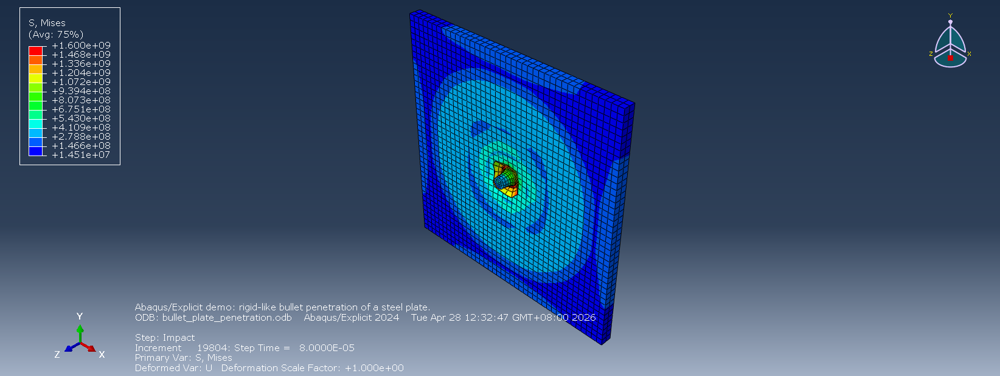

# Bullet Plate Penetration Abaqus Demo

This example was generated and solved with Abaqus 2024. It demonstrates an Abaqus/Explicit impact workflow driven by AI-generated Abaqus Python scripts.

## Files

- `create_bullet_plate_penetration.py` builds the Abaqus/Explicit model.
- `postprocess_bullet_plate.py` reads the ODB and prints a compact result summary.
- `images/bullet_plate_result.png` shows the final stress field preview.

Large solver outputs such as `bullet_plate_penetration.cae`, `bullet_plate_penetration.inp`, and `bullet_plate_penetration.odb` are generated locally and are not committed by default.

## Model

- Unit system: m, kg, s, Pa.
- Plate: 0.20 m x 0.20 m x 0.010 m mild steel.
- Bullet: hardened steel, 0.005 m radius, 0.030 m total length, with a small flat tip for mesh stability.
- Step: Abaqus/Explicit, `8.0e-5 s`.
- Initial bullet velocity: 800 m/s in the negative Z direction.
- Contact: general contact with hard normal behavior and 0.12 friction coefficient.
- Boundary condition: plate outer edges fully clamped.

## Commands

Generate the model:

```powershell
abaqus cae noGUI=create_bullet_plate_penetration.py
```

Run the analysis:

```powershell
abaqus job=bullet_plate_penetration input=bullet_plate_penetration.inp interactive
```

Postprocess:

```powershell
abaqus python postprocess_bullet_plate.py
```

## Verified Result

The explicit job completed successfully. The ODB summary from the final frame was:

```text
Frames: 21
Final step time: 7.999999797903001e-05
Max PEEQ: 28.214656829833984
Max Mises stress: 1600000768.0
Average bullet U3: -0.019449232882936988
```


